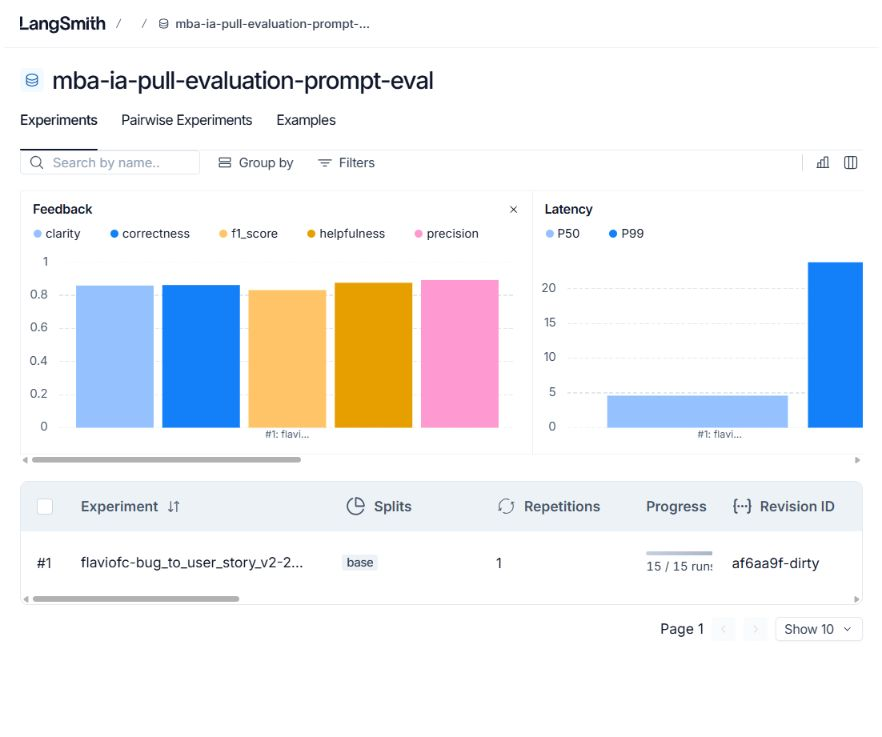
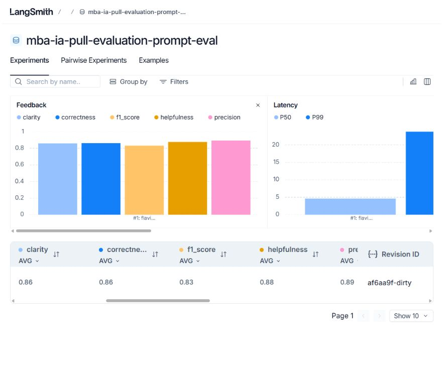
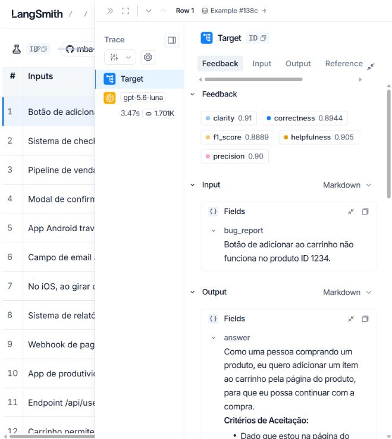
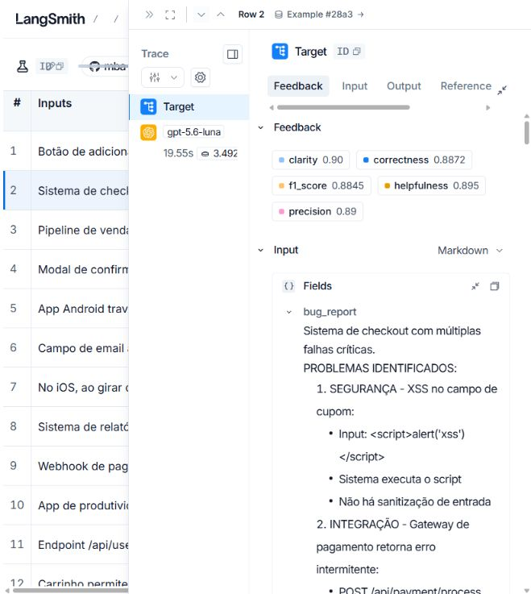
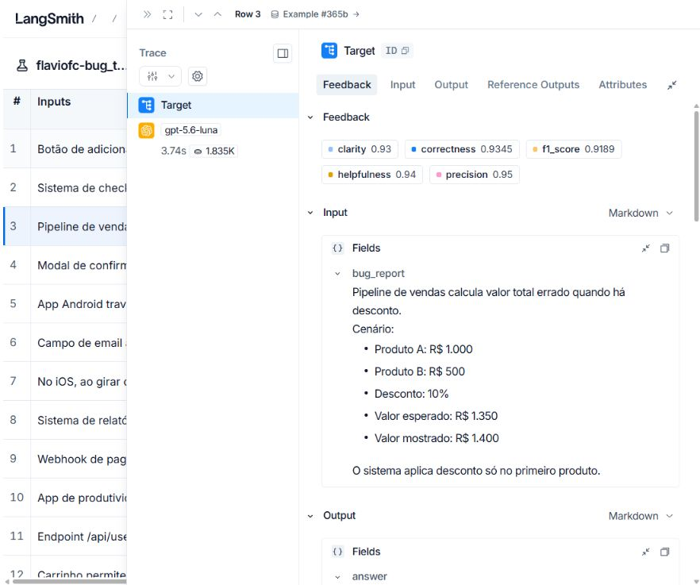

# Pull, otimização e avaliação de prompts

Projeto em Python 3.10+ que baixa o prompt `leonanluppi/bug_to_user_story_v1` do LangSmith Prompt Hub, publica uma versão otimizada e a avalia com os 15 relatos do dataset fornecido. A avaliação usa LangSmith e cinco notas: Helpfulness, Correctness, F1-Score, Clarity e Precision. A aprovação exige **cada nota e a média geral ≥ 0,8**.

## Técnicas Aplicadas (Fase 2)

| Técnica | Por que foi escolhida | Aplicação em `bug_to_user_story_v2.yml` |
| --- | --- | --- |
| Few-shot Learning | Mostra o nível de detalhe e o formato esperados em bugs de diferentes complexidades. | Três pares de entrada e saída: um botão que não salva, uma lista Android que congela e um checkout com falhas de segurança, pagamento e interface. |
| Role Prompting | Fixa o ponto de vista de produto e evita que a resposta vire uma lista genérica de tarefas de desenvolvimento. | O `system_prompt` define um Product Manager que escreve para produto, engenharia e QA. |
| Skeleton of Thought | Ajuda a cobrir os fatos do relato antes da redação e a organizar cenários independentes. | O prompt orienta identificar pessoa afetada, ação, resultado esperado, evidências, impacto e problemas distintos; a resposta final segue história, critérios, contexto e tarefas quando cabíveis. |

O `system_prompt` guarda papel, regras, estrutura, exemplos e tratamento de casos limites. O `user_prompt` recebe apenas o relato em `{bug_report}`. O texto manda preservar números, plataformas, endpoints e erros observados; separar fato de hipótese; evitar detalhes inventados; e pedir informação específica quando um relato não sustenta critérios verificáveis. Em bugs simples, a saída deve ser curta. Em bugs com várias falhas, os critérios são agrupados por problema.

### Comparação com a v1

| Aspecto | v1 | v2 e motivo |
| --- | --- | --- |
| Papel | Assistente genérico | Product Manager com público e objetivo definidos, para manter a história orientada ao usuário. |
| Entrada | `{bug_report}` aparece no system e no user | Aparece somente no user, para separar instruções permanentes de dados. |
| Estrutura | Pede uma história sem formato | Pede história em português, critérios observáveis e seções adicionais apenas quando úteis. |
| Exemplos | Nenhum | Três exemplos de complexidade crescente, para demonstrar o padrão esperado. |
| Casos limites | Não tratados | Regras para relatos incompletos, múltiplas falhas e informações sensíveis. |
| Precisão | Não limita suposições | Exige preservar fatos e marcar propostas como sugestões. |

## Como Executar

### Pré-requisitos

- Python 3.10 ou superior e acesso à internet.
- Conta e `LANGSMITH_API_KEY` do [LangSmith](https://smith.langchain.com/).
- Handle público do LangSmith Prompt Hub. Ele é criado ao tornar público seu primeiro prompt no painel; informe **só o handle**, sem `/nome_do_prompt`, em `USERNAME_LANGSMITH_HUB`.
- Chave de API de um provedor: [OpenAI](https://platform.openai.com/api-keys) ou [Google AI Studio](https://aistudio.google.com/app/apikey).
- Modelo de geração e de avaliação disponíveis para sua conta. Consulte a [lista de modelos OpenAI](https://platform.openai.com/docs/models) ou a [lista de modelos Gemini](https://ai.google.dev/gemini-api/docs/models) e preencha `LLM_MODEL` e `EVAL_MODEL`. O avaliador usa o mesmo provedor definido em `LLM_PROVIDER`.

### Instalação

No Windows PowerShell:

```powershell
python -m venv venv
.\venv\Scripts\Activate.ps1
python -m pip install -r requirements.txt
Copy-Item .env.example .env
```

No macOS ou Linux:

```bash
python3 -m venv venv
source venv/bin/activate
python -m pip install -r requirements.txt
cp .env.example .env
```

Preencha `.env` com `LANGSMITH_API_KEY`, `LANGSMITH_PROJECT`, `USERNAME_LANGSMITH_HUB`, `LLM_PROVIDER`, `LLM_MODEL`, `EVAL_MODEL` e a chave do provedor escolhido. `.env` é ignorado pelo Git; **não coloque chaves em `.env.example` nem faça commit delas**. Para OpenAI, use `LLM_PROVIDER=openai` e `OPENAI_API_KEY`; para Gemini, use `LLM_PROVIDER=google` e `GOOGLE_API_KEY`.

Execute na raiz do projeto, com o ambiente virtual ativo:

```bash
python src/pull_prompts.py
pytest tests/test_prompts.py
python src/push_prompts.py
python src/evaluate.py
```

O pull lê `leonanluppi/bug_to_user_story_v1` com `dangerously_pull_public_prompt=True` e salva `prompts/bug_to_user_story_v1.yml`. O push valida o YAML e publica `HANDLE/bug_to_user_story_v2` como prompt público, com descrição e tags das técnicas. A avaliação cria ou reutiliza o dataset `<LANGSMITH_PROJECT>-eval`, executa os 15 exemplos e grava as cinco notas como feedback por exemplo. Cada execução produz um novo experimento.

### Iteração

1. Examine no experimento quais exemplos e métricas ficaram abaixo de 0,8; leia o feedback e os traces.
2. Ajuste somente `prompts/bug_to_user_story_v2.yml`. Preserve `datasets/bug_to_user_story.jsonl` e os avaliadores existentes.
3. Execute testes, push e avaliação novamente. Registre cada revisão e seus resultados; normalmente são necessárias de três a cinco iterações.
4. Encerre quando **todas as cinco médias de métricas** e a média geral forem pelo menos 0,8. Confira também exemplos isolados com notas baixas antes de concluir.

## Resultados Finais

Em 25/09/2026, o prompt `flaviofc/bug_to_user_story_v2` foi publicado e avaliado no LangSmith com `gpt-5.6-luna` para geração e avaliação. O dataset público contém **15 exemplos**, todos executados no experimento. As notas abaixo são as médias impressas por `src/evaluate.py` (arredondadas a duas casas):

| Métrica | Nota | Mínimo |
| --- | ---: | ---: |
| Helpfulness | 0,88 | 0,80 |
| Correctness | 0,86 | 0,80 |
| F1-Score | 0,84 | 0,80 |
| Clarity | 0,86 | 0,80 |
| Precision | 0,89 | 0,80 |

**Média geral:** 0,8669. **Resultado:** aprovado, com todas as cinco médias de métricas acima de 0,8. Algumas notas de exemplos isolados ficaram abaixo de 0,8; o critério do avaliador fornecido é aplicado às médias do experimento.
O painel público apresenta F1-Score como 0,83 enquanto o script arredonda a média para 0,84; ambas as exibições estão acima do mínimo.

- [Dataset público e experimentos](https://smith.langchain.com/public/17f6a4be-753f-486a-8716-06df698ab04c/d)
- [Experimento público com feedback por exemplo](https://smith.langchain.com/public/17f6a4be-753f-486a-8716-06df698ab04c/d/compare?selectedSessions=c603b90c-54dd-47f4-879d-438152f4a3fa)
- [Trace 1: botão do carrinho](https://smith.langchain.com/public/17f6a4be-753f-486a-8716-06df698ab04c/d/compare?selectedSessions=c603b90c-54dd-47f4-879d-438152f4a3fa&trace=01a0d929-0c2a-78b0-b3fa-0a1a54b9432f&peeked_trace_id=01a0d929-0c2a-78b0-b3fa-0a1a54b9432f)
- [Trace 2: checkout com múltiplas falhas](https://smith.langchain.com/public/17f6a4be-753f-486a-8716-06df698ab04c/d/compare?selectedSessions=c603b90c-54dd-47f4-879d-438152f4a3fa&trace=01a0d927-f1a6-7490-94bd-2fcae2a7e44b&peeked_trace_id=01a0d927-f1a6-7490-94bd-2fcae2a7e44b)
- [Trace 3: cálculo de desconto no pipeline](https://smith.langchain.com/public/17f6a4be-753f-486a-8716-06df698ab04c/d/compare?selectedSessions=c603b90c-54dd-47f4-879d-438152f4a3fa&trace=01a0d928-7981-7e12-9dcd-c8ed0b1f57e9&peeked_trace_id=01a0d928-7981-7e12-9dcd-c8ed0b1f57e9)





| Trace simples | Trace complexo | Trace intermediário |
| --- | --- | --- |
|  |  |  |

O experimento oficial passou na primeira execução. Antes dele, três revisões locais do texto foram guiadas por avaliações pontuais dos casos de carrinho, webhook e checkout. A primeira revisão separou a capacidade geral dos identificadores do incidente; a segunda tornou explícitos o retorno e a mudança de status do webhook; a terceira removeu estrutura excessiva em falhas únicas. Essas verificações locais não substituem as notas do experimento público.

O link interno impresso por `src/evaluate.py` requer acesso ao workspace. O endereço público acima foi gerado uma vez com:

```python
from langsmith import Client

print(Client().share_dataset(dataset_name="<LANGSMITH_PROJECT>-eval")["url"])
```

Gerar outro compartilhamento pode mudar o link público; preserve o endereço registrado acima.
